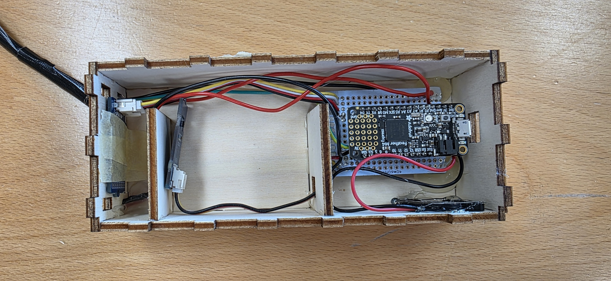
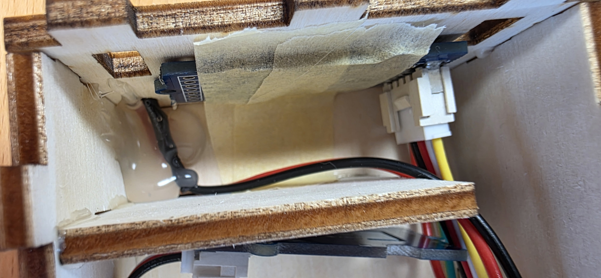
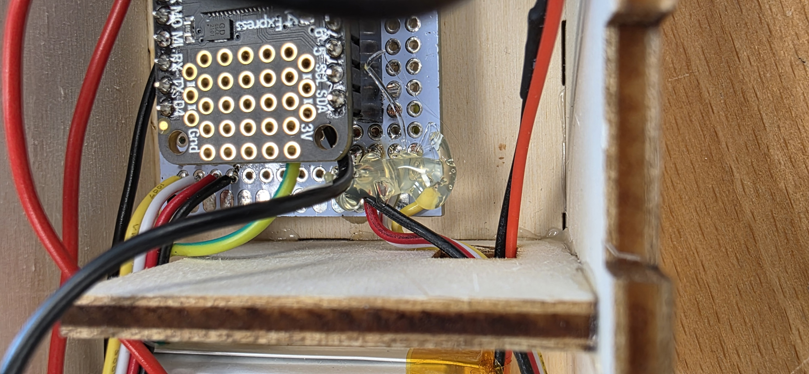

# Assembly

{{BOM}}

## Place the electronics in the box {pagestep}

Fit the protoboard and sensors into [the created enclosure](./enclosure.md){step}. Connect the [LiPo Battery]{Qty: 1} to the Feather M4 and tuck it into the middle compartment. Route the [USB A (or C) to micro USB cable]{Qty: 1, Cat: Tool} through the charging port hole. Make sure the OLED display sits flush in its slot and the soil moisture sensor cable exits through its opening.

## Hot glue everything in place {pagestep}

Use a [Hot Glue Gun]{Qty: 1, Cat: Tool} to secure the protoboard, sensors, and cables inside the box. Apply glue to the corners of the components and hold them in place until the glue sets. Avoid getting glue on connectors or the display.

## Close the box {pagestep}

Press the lid on firmly. We recommend not using any glue here, so you can open it up later on.

## Final test {pagestep}

Power on the Plantochi. Check that the display lights up, the sensors report readings, and the piezo buzzer works. Place the moisture sensor in soil and verify the display reacts to changes.

[LiPo Battery]: ../Parts.yaml#LiPoBattery
[Hot Glue Gun]: ../Parts.yaml#HotGlueGun
[Wood Glue]: ../Parts.yaml#WoodGlue
[USB A (or C) to micro USB cable]: ../Parts.yaml#USBMicroCable
