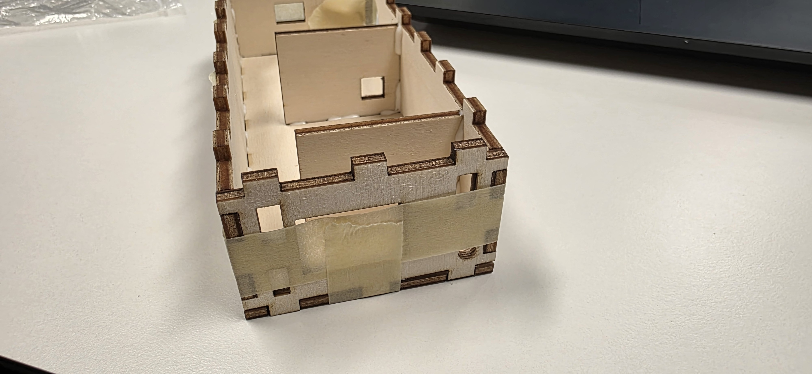
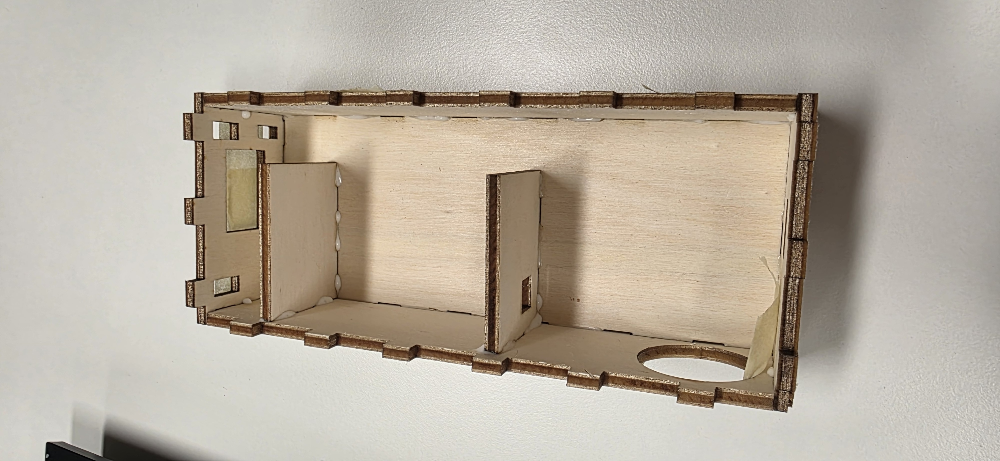

# Cut the enclosure

{{BOM}}

## Download the necessary files {pagestep}

Download the files:

- [plantochi_box.svg](../images/day_3/plantochi_box.svg)
- [plantochi_box_v2.svg](../images/day_3/plantochi_box_v2.svg)

>i **Note**
>i
>i Note that you need to download and cut **both** files.

## Make the laser cutter go BRRR {pagestep}

Take both files to your [laser cutter]{Qty: 1, Cat: Tool} and cut them from one [A4 plywood sheet]{Qty: 2} each.

## Glue everything together {pagestep}

Take some [wood glue]{Qty: 1, Cat: Tool} and glue everything together.

[A4 plywood sheet]:  ../Parts.yaml#Wood
[laser cutter]:  ../Parts.yaml#LaserCutter
[wood glue]:  ../Parts.yaml#WoodGlue