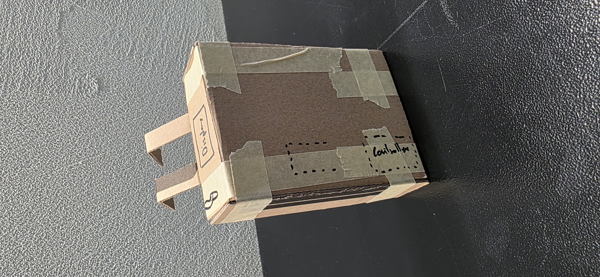
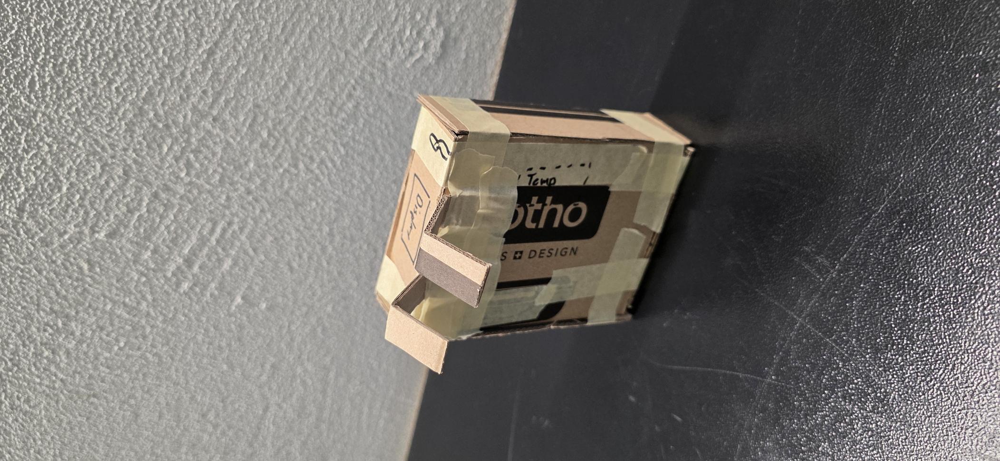
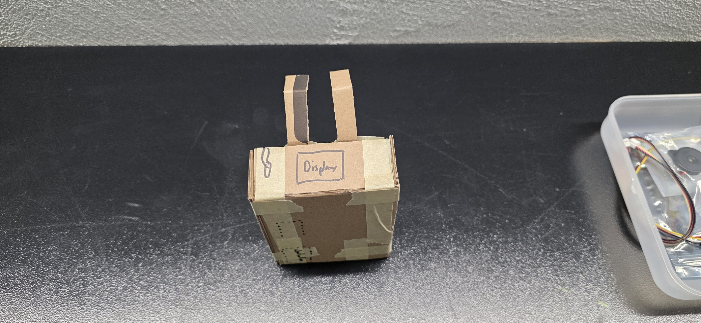
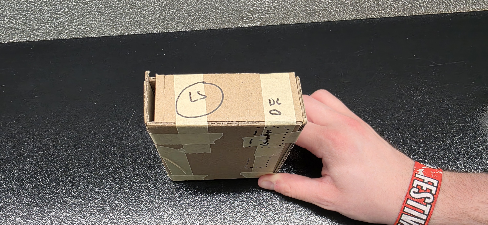

# Journey

## Day 1

On day 1, we only had a short brainstorming session. See the results below.

### Brainstorming


From a first brainstorming session, we identified different things, with different priorities.
We decided on three priorities, with the following features:

| Priority (High to Low) | Features |
|-|-|
| 1 | Display and sound as output. Soil moisture sensor. Indoor only. |
| 2 | Air, temperature, light sensors in addition. |
| 3 | Motion (e.g. vibrating) as another way to get attention. A solar panel as energy source. Also rated for outdoor use.|

## Day 2

Creation of the first proof of concept (PoC) and prototypes. We also thought about how we can and should display the values to a user.

### Prototype Box

The first cardboard prototype was essentially a big box, with two hooks to put it onto a flower pot. The MCU (microcontroller unit) is placed towards the bottom so that the charging port can be placed below the box, together with the speaker which is hidden there. The display, light sensor and cabels to extends to the soil moisture sensore, are placed on the top.






### UI (Emotions)

Emotions are used to communicate with the user. Emotions like too bright or dark are naturally exclusive with each other. The following emotions are possible:

- Thirsty or waterlogged
- Too bright or dark
- Too hot or cold

The OLED displaying a face will be used to express the emotions.

| Sensors | Display |
|-------------|----------------------------------|
| Thirsty | Open Mouth |
| Waterlogged | Sad Mouth |
| Bright | Squinted Eyes or Sunglasses |
| Dark | Big Eyes with huge pupils |
| Hot | Waves (like the ones on heaters) |
| Cold | Snowflake |

If two emotions concur at the same time, or it is "Thirsty", a piezo will be activated to cause sleepless nights.

### PoC

### Code

```{.c}
#include <Arduino.h>
#include <U8g2lib.h>
#include <Wire.h>
#include "Adafruit_SHT31.h"

#ifdef U8X8_HAVE_HW_SPI
#include <SPI.h>
#endif
#ifdef U8X8_HAVE_HW_I2C
#include <Wire.h>
#endif

#define LS_PIN 5
#define MOISTURE_PIN A5
#define LDR_PIN A4


U8G2_SSD1306_128X64_NONAME_F_HW_I2C u8g2(U8G2_R0, SCL, SDA, U8X8_PIN_NONE);
Adafruit_SHT31 sht31 = Adafruit_SHT31();

void setup(void) {
  Serial.begin(115200);

  sht31.begin(0x44);
  u8g2.begin();
}

void loop(void) {
  
  u8g2.clearBuffer();					// clear the internal memory
  u8g2.setFont(u8g2_font_ncenB08_tr);	// choose a suitable font
  u8g2.drawStr(0,10,"Hello World!");	// write something to the internal memory
  u8g2.sendBuffer();					// transfer internal memory to the display
  delay(1000);  

  int sensorValue = analogRead(MOISTURE_PIN);
  Serial.print("Moist: ");
  Serial.println(sensorValue);
  delay(1000);        // delay in between reads for stability

  int light = analogRead(LDR_PIN);
  Serial.print("LDR: ");
  Serial.println(light);
  delay(1000);


  float t = sht31.readTemperature();
  float h = sht31.readHumidity();

  if (! isnan(t)) {  // check if 'is not a number'
    Serial.print("Temp *C = "); Serial.print(t); Serial.print("\t\t");
  } else { 
    Serial.println(t);
    Serial.println("Failed to read temperature");
  }
  
  if (! isnan(h)) {  // check if 'is not a number'
    Serial.print("Hum. % = "); Serial.println(h);
  } else { 
    Serial.println(h);
    Serial.println("Failed to read humidity");
  }

  delay(1000);

  drawSmiley();

  delay(1000);

  tone(LS_PIN, 1000);
  delay(1000);
  noTone(LS_PIN);
}

void drawSmiley() {
  u8g2.clearBuffer();
  
  // 1. Face (x, y, radius)
  u8g2.drawCircle(64, 32, 25);
  
  // 2. Eyes (x, y, radius)
  u8g2.drawDisc(54, 25, 3);
  u8g2.drawDisc(74, 25, 3);
  
  // 3. Smile (x, y, radius, start_angle, end_angle)
  // For U8g2, angles are often 0-255 where 255 = 360 degrees.
  // To get a half-circle (180 degrees), we use 0 to 127.
  u8g2.drawArc(64, 38, 15, 0, 127); 
  
  u8g2.sendBuffer();
}
```

#### Sketch of the PoC

A first sketch of the prototype is displayed below.
It is used to get some sense of what components we need and a bit on how they are supposed to be wired up.


As there are about three craploads of components, we went on an expedition with our shovels and pickaxes and selected the components according to our plan.

#### Pinout

Description and more details: [https://learn.adafruit.com/adafruit-feather-m4-express-atsamd51/pinouts](https://learn.adafruit.com/adafruit-feather-m4-express-atsamd51/pinouts)


## Day 3
