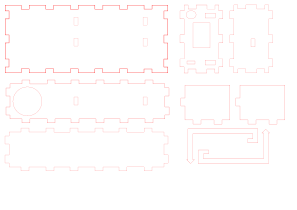
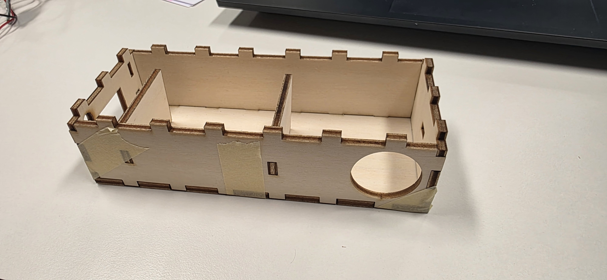
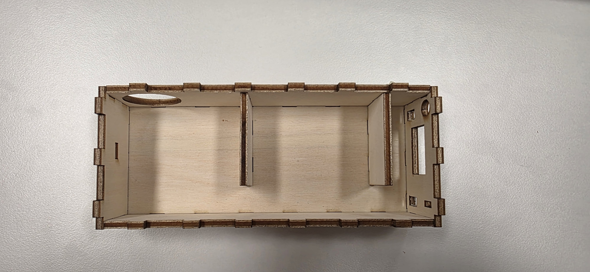
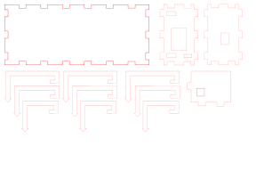

# Journey

## Day 1

On day 1, we only had a short brainstorming session. See the results below.

### Brainstorming


From a first brainstorming session, we identified different things, with different priorities.
We decided on three priorities, with the following features:

| Priority (High to Low) | Features |
|-|-|
| 1 | Display and sound as output. Soil moisture sensor. Indoor only. |
| 2 | Air, temperature, light sensors in addition. |
| 3 | Motion (e.g. vibrating) as another way to get attention. A solar panel as energy source. Also rated for outdoor use.|

## Day 2

Creation of the first proof of concept (PoC) and prototypes. We also thought about how we can and should display the values to a user.

### Prototype Box

The first cardboard prototype was essentially a big box, with two hooks to put it onto a flower pot. The MCU (microcontroller unit) is placed towards the bottom so that the charging port can be placed below the box, together with the speaker which is hidden there. The display, light sensor and cabels to extends to the soil moisture sensore, are placed on the top.


### UI (Emotions)

Emotions are used to communicate with the user. Emotions like too bright or dark are naturally exclusive with each other. The following emotions are possible:

- Thirsty or waterlogged
- Too bright or dark
- Too hot or cold

The OLED displaying a face will be used to express the emotions.

| Sensors | Display |
|-------------|----------------------------------|
| Thirsty | Open Mouth |
| Waterlogged | Sad Mouth |
| Bright | Squinted Eyes or Sunglasses |
| Dark | Big Eyes with huge pupils |
| Hot | Waves (like the ones on heaters) |
| Cold | Snowflake |

If two emotions concur at the same time, or it is "Thirsty", a piezo will be activated to cause sleepless nights.

### PoC

### Code

You can see the code for the first prototype [here](../code/poc_1/poc_1.ino).

#### Sketch of the PoC

A first sketch of the prototype is displayed below.
It is used to get some sense of what components we need and a bit on how they are supposed to be wired up.


As there are about three craploads of components, we went on an expedition with our shovels and pickaxes and selected the components according to our plan.

#### Pinout

Description and more details: [https://learn.adafruit.com/adafruit-feather-m4-express-atsamd51/pinouts](https://learn.adafruit.com/adafruit-feather-m4-express-atsamd51/pinouts)


## Day 3

Today was mostly spent finishing up the code and designing the enclosure.

### Code

The code was split in mutliple files to make it *somewhat* more managable. This brought the core loop to look like this:

```{.c}
void loop(void) {
  int badStates = 0;
  bool isThirsty = 0;

  Symbol symbol = Symbol::NONE;
  Eyes eyes = Eyes::NORMAL;
  Mouth mouth = Mouth::HAPPY;

  float light = readSensor(LIGHT);
  if(light > L_THRESHOLD_HIGH){
    eyes = Eyes::SQUINT;
    badStates++;
  } else if (light < L_THRESHOLD_LOW){
    eyes = Eyes::BIG;
    badStates++;
  } else {
    eyes = Eyes::NORMAL;
  }

  float airTemp = readSensor(AIR_TEMPERATURE);
  if(airTemp > T_THRESHOLD_HIGH){
    badStates++;
    symbol = Symbol::HEAT;
  } else if (airTemp < T_THRESHOLD_LOW){
    badStates++;
    symbol = Symbol::COLD;
  } else {
    symbol = Symbol::NONE;
  }

  // The value of the moisture sensor decreases
  // as the moisture increases
  float soilMoisture = readSensor(SOIL_MOISTURE);
  if(soilMoisture > M_THRESHOLD_HIGH){
    badStates++;
    isThirsty = 1;
    mouth = Mouth::OPEN;
  } else if (soilMoisture < M_THRESHOLD_LOW){
    badStates++;
    mouth = Mouth::SAD;
  } else {
    mouth = Mouth::HAPPY;
  }

  displayClear();
  displaySmiley(symbol, eyes, mouth);
  String text = getText(badStates);
  displayText(text.c_str());
  displayShow();

  if((isThirsty || badStates > 1) && !isBeeping){
    startBeep();
  } else {
    stopBeep();
  }

  updateBeep();

  // Cooldown
  delay(1500);
}
```

You can see the entire code under `/code/prod/`.

### Enclosure

The plantochi should be usable for all kinds of plants.
Some of these plants generate produce.
The PLA that is used in the schools’ 3D-printers, is not particularly food safe.
Therefore, wood was used for the box which is laser cut from sheets.



After laser cutting the box was assembled and held together by strong willpower, prayers and some tape.




Some details were noticed when putting the components into the box:

- The cable for the display is very short and needs to reach very far
  - Moving the display slot a bit over
  - Switching the orientation for the box, so that the display points the right way (parts of the display are blue and 
    yellow and this needs to face the right direction).
- Increase the size for the soil moisture sensor cable.
- Decrease the size for the LDR sensor (must have been drunk while measuring that).
- Adding a little hole in the wall for the battery.
- Increasing the size for the charging cable (those suckers are huge).



After planning all the details and creating different mount options (based on flower pot sizes), the **Next Gen Box 2.0** 
is released.
The **Next Gen Box 2.0** comes without any problems and can actually be used with the selected components.
Some wood glue and tape later, it is assembled and ready for tomorrow's hot glue day, where we make fit everything in 
the box.


