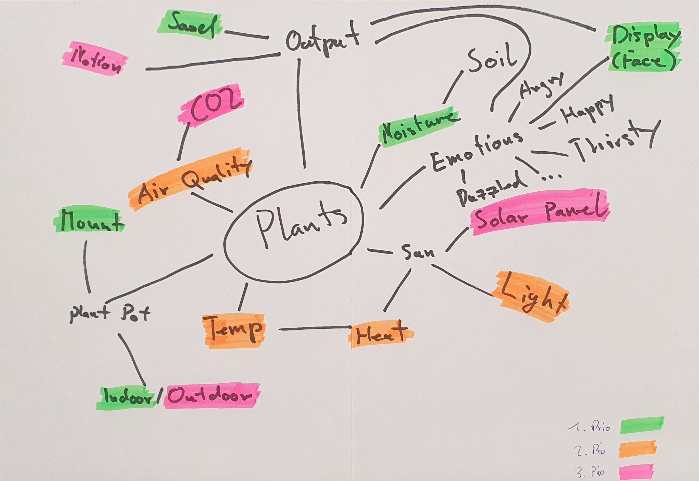
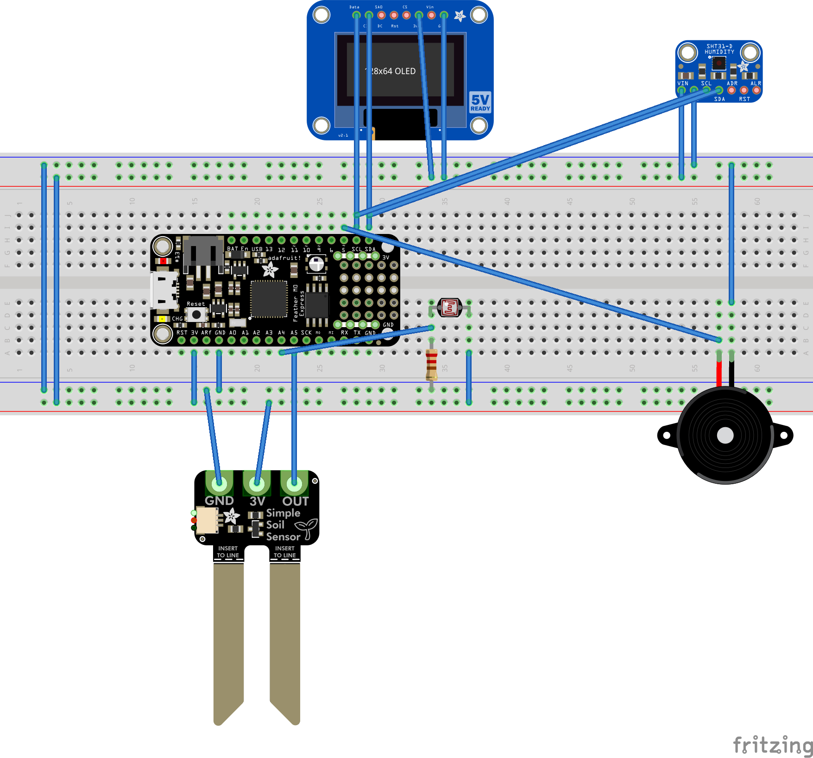
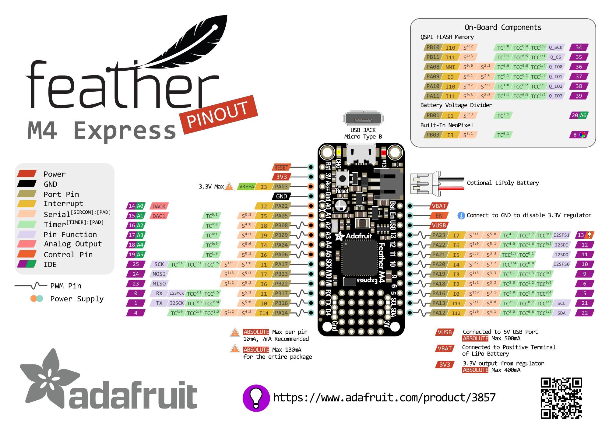

# Journey

## Day 1 : Brainstorming

From a first brainstorming session, we identified different things, with different priorities.

## Day 2

### Prototype Box

### Emotions

The emotions are exclusive like so: Thirsty / Waterlogged, Bright / Dark, Hot / Cold.
An OLED displaying a face will be used to express the emotions.

| Sensors | Display |
|-------------|----------------------------------|
| Thirsty | Open Mouth |
| Waterlogged | Sad Mouth |
| Bright | Squinted Eyes or Sunglasses |
| Dark | Big Eyes with huge pupils |
| Hot | Waves (like the ones on heaters) |
| Cold | Snowflake |

If two emotions concur at the same time, or it is "Thirsty", a piezo will be activated to cause you sleepless nights.

### Sketch of the Prototype

A first sketch of the prototype is displayed below.
It is used to get some sense of what components we need and a bit on how they are supposed to be wired up.

As there are about three craploads of components, we went on an expedition with our shovels and pickaxes and selected the components according to our plan.

### Pinout

Description and more details: [https://learn.adafruit.com/adafruit-feather-m4-express-atsamd51/pinouts](https://learn.adafruit.com/adafruit-feather-m4-express-atsamd51/pinouts)

## Day 3
